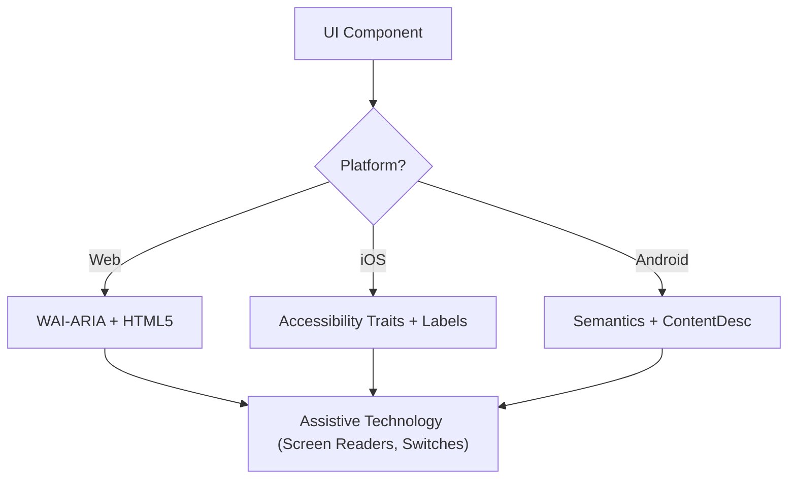

# Accessibility (WCAG 2.2)

このスキルは、screen reader、switch control、keyboard navigationを使う利用者を含むすべての人にとって、デジタルインターフェースが知覚可能・操作可能・理解可能・堅牢（POUR）であることを保証する。WCAG 2.2の達成基準の技術的な実装に焦点を当てる。

## いつ使うか

- Web、iOS、AndroidのUI componentの仕様を定義するとき。
- 既存コードをaccessibilityの障壁や準拠のギャップの観点で監査するとき。
- Target Size (Minimum)やFocus AppearanceといったWCAG 2.2の新しい基準を実装するとき。
- 上位のdesign要件を技術的な属性（ARIA role、trait、hint）へ対応付けるとき。

## 中心となる概念

- **POUR原則**: WCAGの基礎（知覚可能、操作可能、理解可能、堅牢）。
- **semanticな対応付け**: 汎用のcontainerではなくnative要素を使い、組み込みのaccessibilityを得る。
- **accessibility tree**: 支援技術が実際に「読む」UIの表現。
- **focus管理**: keyboard/screen readerのカーソルの順序と可視性を制御する。
- **labelとhint**: `aria-label`、`accessibilityLabel`、`contentDescription`で文脈を与える。

## 仕組み

### Step 1: componentのroleを特定する

機能上の目的を判断する（例: これはbutton、link、tabのどれか）。custom roleに頼る前に、利用できる最もsemanticなnative要素を使う。

### Step 2: 知覚可能な属性を定義する

- テキストのコントラストが**4.5:1**（通常）または**3:1**（大きい文字/UI）を満たすようにする。
- 非テキストコンテンツ（画像、icon）に代替テキストを追加する。
- レスポンシブなreflowを実装する（400%までのzoomで機能を失わない）。

### Step 3: 操作可能なコントロールを実装する

- 最小**24x24 CSSピクセル**のtarget sizeを確保する（WCAG 2.2 SC 2.5.8）。
- すべてのinteractiveな要素がkeyboardで到達でき、可視のfocus indicatorを持つことを確認する（SC 2.4.11）。
- ドラッグ操作にはsingle pointerの代替手段を用意する。

### Step 4: 理解可能なロジックにする

- 一貫したnavigationパターンを使う。
- 説明的なエラーメッセージと修正案を提示する（SC 3.3.3）。
- 同じdataを二度求めないよう「Redundant Entry」（SC 3.3.7）を実装する。

### Step 5: 堅牢な互換性を確認する

- 正しい`Name, Role, Value`のパターンを使う。
- 動的なステータス更新のために`aria-live`やlive regionを実装する。

## accessibilityアーキテクチャ図



## プラットフォーム横断の対応表

| 機能               | Web (HTML/ARIA)          | iOS (SwiftUI)                        | Android (Compose)                                           |
| :----------------- | :----------------------- | :----------------------------------- | :---------------------------------------------------------- |
| **主label**        | `aria-label` / `<label>` | `.accessibilityLabel()`              | `contentDescription`                                        |
| **補助hint**       | `aria-describedby`       | `.accessibilityHint()`               | `Modifier.semantics { stateDescription = ... }`             |
| **操作role**       | `role="button"`          | `.accessibilityAddTraits(.isButton)` | `Modifier.semantics { role = Role.Button }`                 |
| **live更新**       | `aria-live="polite"`     | `.accessibilityLiveRegion(.polite)`  | `Modifier.semantics { liveRegion = LiveRegionMode.Polite }` |

## 例

### Web: アクセシブルな検索

```html
<form role="search">
  <label for="search-input" class="sr-only">Search products</label>
  <input type="search" id="search-input" placeholder="Search..." />
  <button type="submit" aria-label="Submit Search">
    <svg aria-hidden="true">...</svg>
  </button>
</form>
```

### iOS: アクセシブルな操作button

```swift
Button(action: deleteItem) {
    Image(systemName: "trash")
}
.accessibilityLabel("Delete item")
.accessibilityHint("Permanently removes this item from your list")
.accessibilityAddTraits(.isButton)
```

### Android: アクセシブルなtoggle

```kotlin
Switch(
    checked = isEnabled,
    onCheckedChange = { onToggle() },
    modifier = Modifier.semantics {
        contentDescription = "Enable notifications"
    }
)
```

## 避けるべきanti-pattern

- **div button**: roleとkeyboard対応を付けずに`<div>`や`<span>`へclickイベントを付ける。
- **色だけによる意味付け**: エラーや状態を色の変化_だけ_で示す（例: borderを赤くする）。
- **閉じ込められていないmodalのfocus**: focusをtrapせず、modalが開いている間もkeyboard利用者が背後のコンテンツへ移動できる。focusは閉じ込められ、_かつ_`Escape`キーまたは明示的な閉じるbuttonで抜けられる必要がある（WCAG SC 2.1.2）。
- **冗長なalt text**: alt textに「〜の画像」「〜の写真」と書く（screen readerは既にrole「画像」を読み上げる）。

## ベストプラクティスのチェックリスト

- [ ] interactiveな要素が**24x24px**（Web）または**44x44pt**（Native）のtarget sizeを満たす。
- [ ] focus indicatorが明確に見え、高コントラストである。
- [ ] modalは開いている間**focusを閉じ込め**、閉じるときに適切に解放する（`Escape`キーまたは閉じるbutton）。
- [ ] dropdownやmenuは閉じるときにtrigger要素へfocusを戻す。
- [ ] formがテキストベースのエラー修正案を提示する。
- [ ] iconのみのbuttonすべてに説明的なテキストlabelがある。
- [ ] テキストを拡大したときコンテンツが適切にreflowする。

## 参考資料

- [WCAG 2.2 Guidelines](https://www.w3.org/TR/WCAG22/)
- [WAI-ARIA Authoring Practices](https://www.w3.org/TR/wai-aria-practices/)
- [iOS Accessibility Programming Guide](https://developer.apple.com/documentation/accessibility)
- [iOS Human Interface Guidelines - Accessibility](https://developer.apple.com/design/human-interface-guidelines/accessibility)
- [Android Accessibility Developer Guide](https://developer.android.com/guide/topics/ui/accessibility)

## 関連スキル

- `frontend-patterns`
- `design-system`
- `liquid-glass-design`
- `swiftui-patterns`
